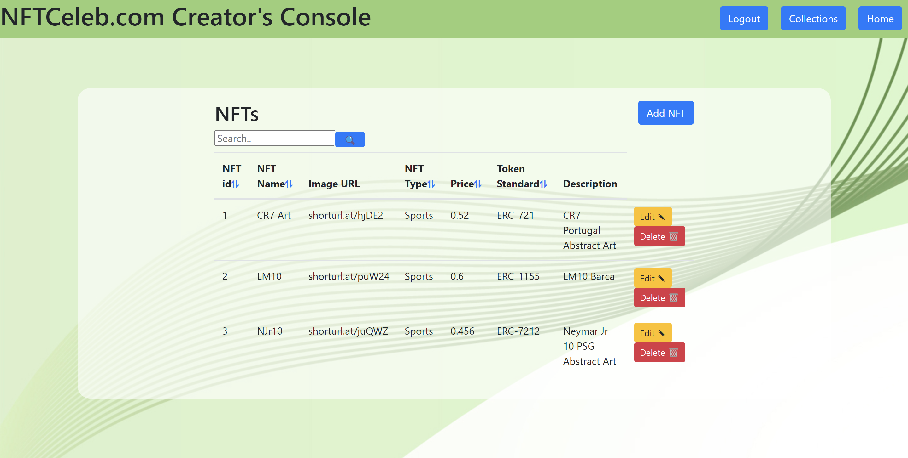

<h1 align="center">NFTCeleb.com Creator's Console</h1>
A Web Based Database Management System for celebrities to create new NFTs and track the Statistics and their fans to manage their NFT holdings. Built using a Python Flask Server.

# Features

- [x] Login / Signup page 
- [x] Page for managing Collections of a celebrity user
  - Add New Collection.
  - Edit / Delete / View Collection details.
  - Search for Collections by ID, Name and Cryptocurrency.
  - Sort by ID, Name and Cryptocurrency in both ascending and descending order.
- [x] Page for managing NFTs of a Collection
  - Add New NFT to Collection.
  - Edit / Delete / View NFT details.
  - Search for NFTs by NFT ID, NFT Name, NFT Type,	Price and Token Standard in specific collection.
  - Sort by NFT ID, NFT Name, NFT Type,	Price and Token Standard in both ascending and descending order.

# UI Screens
<h2 align="center">View All Collections of a User</h2>


<h2 align="center">Add New Collection</h2>

You can specify any random ID for the collection. If the ID is taken already, you'll get a prompt

<h2 align="center">Edit Collection</h2>


<h2 align="center">View Collection / View all NFTs in a Collection</h2>


<h2 align="center">Add New NFT to Collection</h2>

You can specify any random ID for the NFT. If the ID is taken already, you'll get a prompt

<h2 align="center">Edit NFT Details</h2>


<h2 align="center">Search</h2>

You can search for Collections by ID, Name and Cryptocurrency and search for NFTs by NFT ID, NFT Name, NFT Type and Token Standard in specific collection.


# How To Install
- Make sure python is installed in your computer
- Clone the repo
- Go to the root directory of the repo
```sh
> py -m venv ./venv
> py app.py
```
> ❗Whether to use py (or) python (or) python3 may depend on your python version in your computer

# LICENSING
All code in this repository is Licensed Under `BSD-3-Clause license`, and is freely available for anyone to use or make changes.
